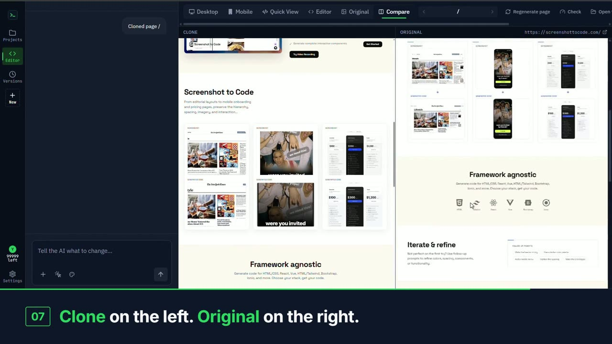

# UrltoCode

**Any website. Working code.** Paste a link: an AI crawler opens the real site in a browser, walks every page, and rebuilds it as clean code you can run, edit and download.

[](frontend/public/demo/urltocode-demo.mp4)

<p align="center"><sub>▶ Click the picture to watch the 90-second demo: a real clone, from URL to finished code.</sub></p>

## How it works

1. **Paste a URL** and hit *Clone*.
2. **It crawls the real site.** A real browser opens every page, embed and legal link, and records what the site actually looks like.
3. **Choose the pages** you want built.
4. **The clone builds up page by page**, as real code in your stack, file by file.
5. **Compare with the original.** The preview has Desktop, Mobile, Quick view, Editor, Original and Compare tabs, so the clone sits next to the site it came from.

Clones come out as a Next.js (App Router) or React (Vite) project, styled with Tailwind CSS.

## What is in the product

- **Accounts.** Sign up with an email, or with GitHub or Google. A free account keeps one project and runs one clone a day.
- **Projects.** Every finished clone is kept on your account and can be opened again from the profile page, without crawling the site a second time.
- **Sharing.** A finished project can be shared by a link.
- **Plans paid in Telegram Stars.** On the website, *Pay* opens the Telegram bot, which sends the invoice for the account that asked. Inside the Telegram Mini App the payment sheet opens directly.
- **A Telegram bot and Mini App.** The bot tells you when a clone is ready and opens the app on that project.

The site opens on a public welcome page at `/welcome`. The app itself (`/`) and the profile page (`/profile`) are behind a sign-in.

## Getting started

The app has a React/Vite frontend and a FastAPI backend. Running locally needs API keys and a backend/frontend setup.

### API keys

You need **at least one** model provider key. Put them in `backend/.env`:

| Key | What it is for |
|-----|----------------|
| `OPENROUTER_API_KEY` / `OPENROUTER_MODEL` | The provider used to write the clone's pages |
| `OPENAI_API_KEY` (and `OPENAI_BASE_URL`, `OPENAI_MODEL`) | OpenAI or any OpenAI-compatible provider |
| `ANTHROPIC_API_KEY` | Claude models |
| `GEMINI_API_KEY` | Gemini models; asset extraction; required for video mode |
| `REPLICATE_API_KEY` | Image generation, editing and background removal (optional) |

You can also enter the OpenAI, Anthropic and Gemini keys in the settings dialog of the app (the gear icon). Replicate is only read from `backend/.env`.

### Run the backend

I use Poetry for package management (`pip install --upgrade poetry` if you don't have it):

```bash
cd backend
poetry install
# The crawler drives Chromium. On Linux, use
# `poetry run playwright install --with-deps chromium` to also install the
# system libraries (needs sudo/apt).
poetry run playwright install chromium
poetry run uvicorn main:app --reload --port 7001
```

Without `DATABASE_URL` the backend keeps accounts in a local SQLite file in `backend/data/`. Set `DATABASE_URL` to a Postgres connection string (for example from Neon) to use a hosted database; the tables are created on first start.

### Run the frontend

```bash
cd frontend
pnpm install
pnpm dev
```

Open http://localhost:5173. It sends you to `/welcome` until you sign in. To run the backend on another port, set `VITE_HTTP_BACKEND_URL` and `VITE_WS_BACKEND_URL` in `frontend/.env.local`.

### Docker

```bash
docker-compose up -d --build
```

The app is then up at http://localhost:5173. You can't develop with this setup, as file changes won't trigger a rebuild.

## Deploying

The site is a static bundle and the bot is a server with a database and a browser, so they live on two hosts: the frontend on **Vercel** (root directory `frontend`) and the backend on a host that can run the Docker image (root directory `backend`).

- [backend/DEPLOY.md](backend/DEPLOY.md): the environment variables, the cookie and CORS setup across two addresses, and what to check after the split.
- [backend/TELEGRAM.md](backend/TELEGRAM.md): creating the bot, the webhook, the Mini App address, and paying from the website.
- [backend/OAUTH.md](backend/OAUTH.md): sign-in with GitHub and Google.
- [backend/DATABASE.md](backend/DATABASE.md): SQLite or Postgres.

## Tests

```bash
cd backend && poetry run pytest && poetry run pyright
cd frontend && pnpm lint && pnpm test
```

## FAQs

- **How do I get an OpenAI API key?** See [Troubleshooting.md](Troubleshooting.md).
- **How can I configure an OpenAI proxy?** Set `OPENAI_BASE_URL` in `backend/.env` (or in the settings dialog). The URL needs `v1` in the path, for example `https://xxx.xxxxx.xxx/v1`.
- **How can I update the backend host my frontend connects to?** Set `VITE_HTTP_BACKEND_URL` and `VITE_WS_BACKEND_URL` in `frontend/.env.local`.
- **Seeing UTF-8 errors when running the backend?** On Windows, open `.env` with an editor that can save as UTF-8 (for example Notepad++, then Encoding → UTF-8).

## Credits

UrltoCode started from [abi/screenshot-to-code](https://github.com/abi/screenshot-to-code) by Abi Raja and is released under the same [MIT license](LICENSE).
